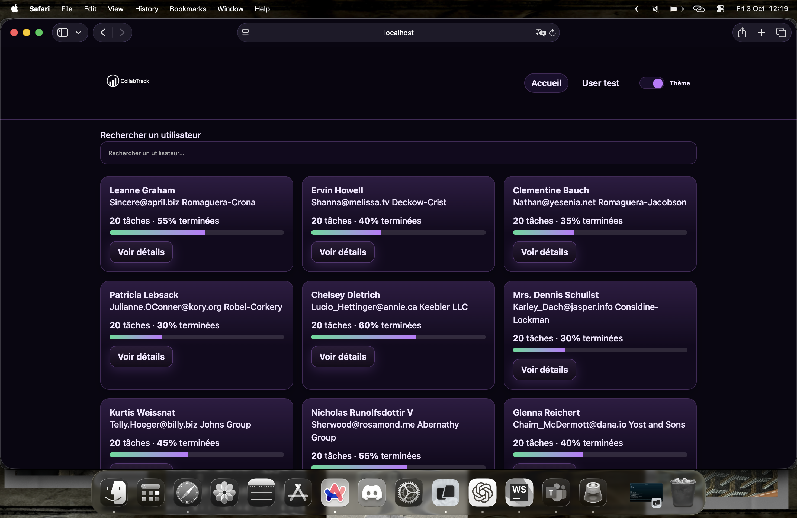
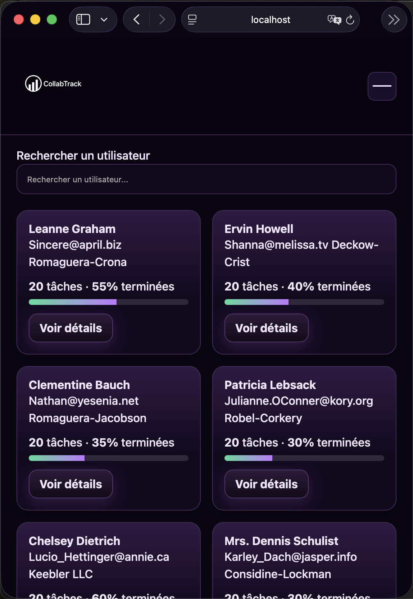
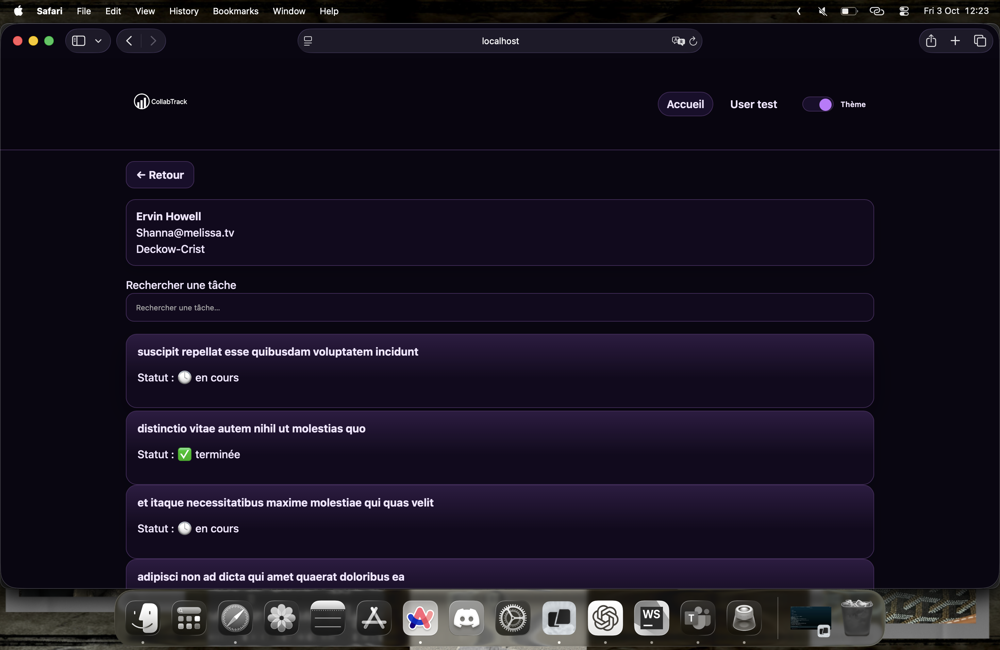

# 🌐 ProjectHub — Portail de Projets et Collaborateurs

Ce projet est un portail web permettant de consulter une liste de collaborateurs, d’accéder à leurs informations détaillées, ainsi que de gérer leurs tâches.  
Il est réalisé en **HTML5, CSS3 et JavaScript Vanilla**, en s’appuyant sur l’API de démonstration [JSONPlaceholder](https://jsonplaceholder.typicode.com).

---

## 🚀 Fonctionnalités

### Page d’accueil (index.html)
- Affichage de la liste des collaborateurs (via `GET /users`).
- Cartes utilisateurs avec avatar (initiales), email, entreprise, localisation.
- Barre de recherche **en temps réel**.
- Option de tri par **Nom / Entreprise / Ville**.
- Statistiques par utilisateur (nombre de tâches et % accomplies, via `GET /todos?userId`).
- Design responsive (1 → 2 → 3 colonnes selon la largeur).

### Page détail utilisateur (user.html)
- Affichage d’une fiche utilisateur complète (nom, email, téléphone, site web, entreprise, adresse).
- Liste des tâches avec statut **en cours / terminée**.
- Barre de recherche locale sur les tâches.
- Formulaire d’ajout d’une tâche (`POST /todos`) avec feedback visuel immédiat.
- Calcul automatique de la progression (% de tâches terminées).

### Thèmes & UX
- Deux thèmes disponibles : **Ocean** (bleu/noir) et **Retro** (violet/néon).
- Switch de thème avec persistance en `localStorage`.
- Loader animé pendant les chargements.
- Transitions et animations douces (`.reveal`, hover, boutons).

### Accessibilité
- Navigation clavier (`:focus-visible` stylé).
- Libellés cachés `sr-only` pour champs de recherche et boutons.
- Attributs ARIA (`aria-current`, `aria-label`, `aria-live`) sur les zones dynamiques.

---

## 🛠️ Technologies utilisées

- **HTML5 sémantique** (header, main, section, article, aria-*…).
- **CSS3 moderne** : variables custom properties, flexbox, grid, media queries, animations.
- **JavaScript Vanilla (ES6)** : fetch API, DOM manipulation, modules globaux.
- **API JSONPlaceholder** pour simuler utilisateurs & tâches.

---

## 📱 Responsive Design

- **< 560px** → 1 colonne (mobile).
- **560px – 900px** → 2 colonnes (tablette).
- **> 900px** → 3 colonnes (desktop).

---

## ⚙️ Installation & Lancement

1. Cloner ou télécharger ce repo :
   ```bash
   git clone git@github.com:malik94400/projet-e1.git
   ```
   
2.	Ouvrir le fichier index.html dans votre navigateur.
(Aucune dépendance ni serveur n’est nécessaire — tout est en JS natif).

---

## 📄 Images du projet

### Page d’accueil (index.html)

### Page d’accueil (index.html) - Mobile


### Page détail utilisateur (user.html)



